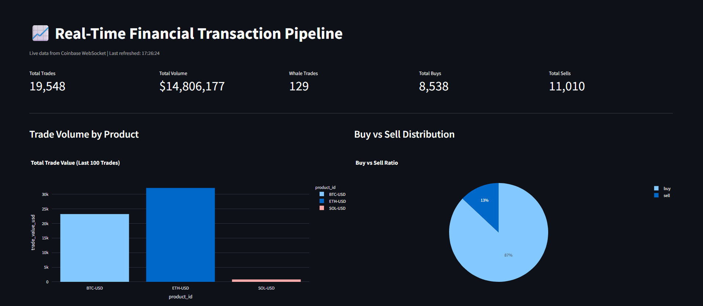
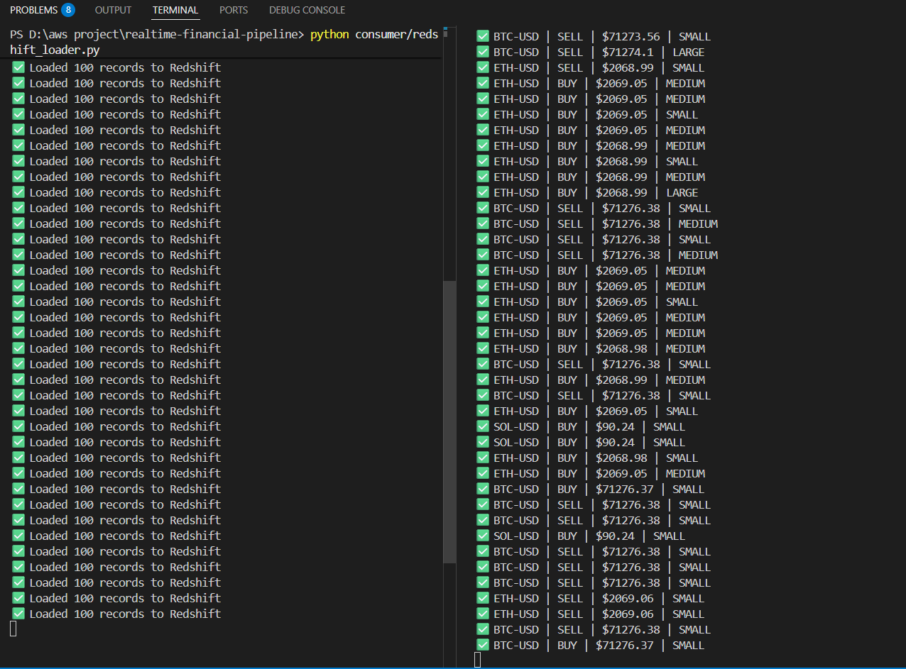
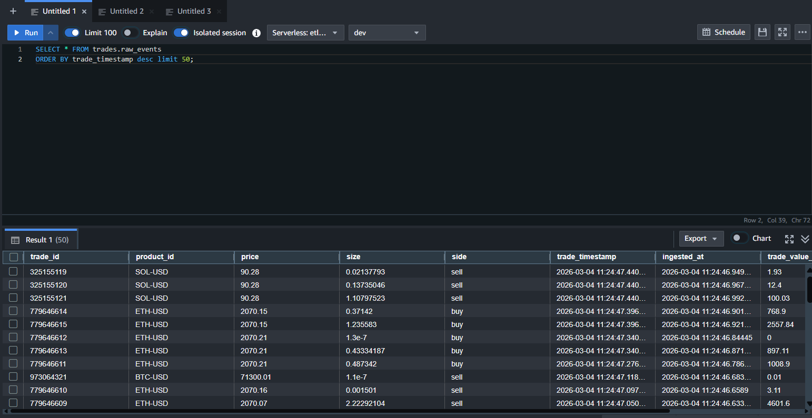
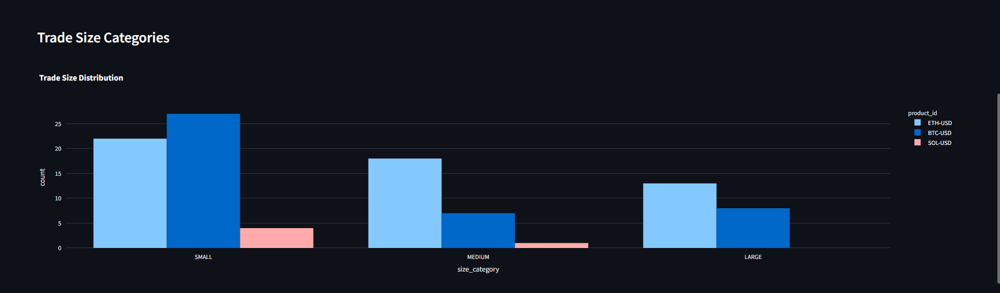
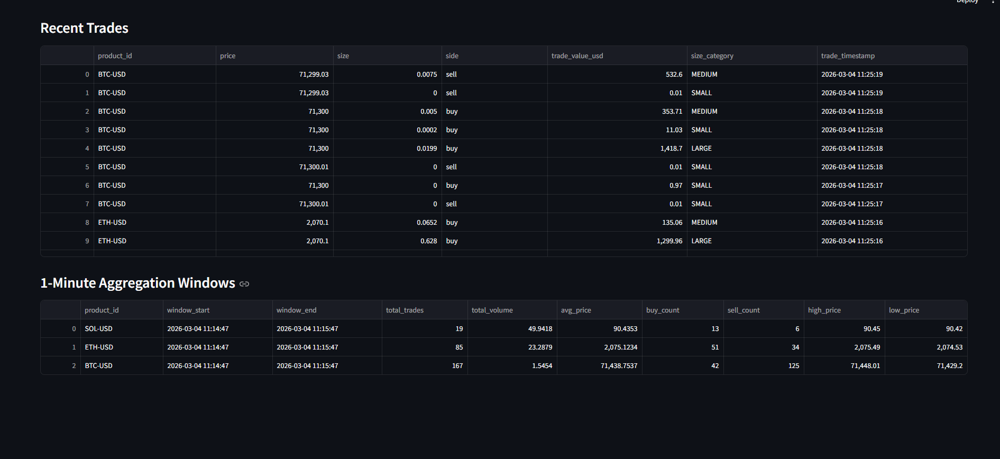

# Real-Time Financial Transaction Pipeline

A production-grade, serverless real-time data pipeline that ingests live cryptocurrency trade events from the **Coinbase WebSocket API**, processes them through **AWS Kinesis and Lambda**, and loads enriched data into **Amazon Redshift** — visualized on a live **Streamlit dashboard**.

> Built iteratively — starting with a Python-based consumer, then evolved into a fully serverless AWS architecture with Lambda, SQS Dead Letter Queue, data quality validation, and deduplication.

---

## Live Pipeline Demo

```
Coinbase WebSocket (live trades: BTC, ETH, SOL)
          │
          ▼
Python Producer (enrichment + validation)
          │
          ▼
AWS Kinesis Data Stream (real-time buffer)
          │
          ▼
AWS Lambda (serverless consumer — auto-triggered)
          │
          ▼
Amazon Redshift (raw_events + trade_summary)
          │
          ▼
Streamlit Dashboard (live metrics, charts, trade feed)
```

---

## Architecture

```
┌─────────────────────────────────────────────────────────┐
│           Coinbase WebSocket API                         │
│     Live trades: BTC-USD, ETH-USD, SOL-USD              │
└──────────────────────┬──────────────────────────────────┘
                       │ websocket-client
                       ▼
┌─────────────────────────────────────────────────────────┐
│              Python Producer                             │
│                                                          │
│  1. Receives raw trade event                             │
│  2. Enriches — calculates trade_value_usd, size_category │
│  3. Validates — price > 0, size > 0, valid side          │
│  4. Pushes to Kinesis via boto3                          │
└──────────────────────┬──────────────────────────────────┘
                       │ boto3 PutRecord
                       ▼
┌─────────────────────────────────────────────────────────┐
│           AWS Kinesis Data Stream                        │
│         1 shard | Provisioned capacity                   │
│      Buffers events for Lambda consumption               │
└──────────────────────┬──────────────────────────────────┘
                       │ Auto-triggers (batch=100, window=5s)
                       ▼
┌─────────────────────────────────────────────────────────┐
│              AWS Lambda                                  │
│                                                          │
│  1. Decodes base64 Kinesis records                       │
│  2. Deduplicates — checks trade_id before insert         │
│  3. Bulk inserts into Redshift                           │
│  4. Failed events → SQS Dead Letter Queue               │
└──────────┬───────────────────────────┬──────────────────┘
           │ Success                   │ Failure
           ▼                           ▼
┌──────────────────┐        ┌─────────────────────┐
│ Amazon Redshift  │        │   AWS SQS (DLQ)      │
│                  │        │ trade-failed-events  │
│ trades.raw_events│        │ Failed records for   │
│ trades.trade_    │        │ reprocessing         │
│ summary          │        └─────────────────────┘
└──────────┬───────┘
           │
           ▼
┌─────────────────────────────────────────────────────────┐
│           Streamlit Dashboard                            │
│  Live metrics | Buy/Sell ratio | Trade size distribution │
│  1-min aggregation windows | Recent trades feed          │
└─────────────────────────────────────────────────────────┘
```

---

## How It Was Built — Evolution

This pipeline was built iteratively, improving at each step:

### Version 1 — Python Consumer (Local)
The first version used a simple Python script running on a local machine:
- Coinbase WebSocket → Python producer → Kinesis → **Python consumer on laptop** → Redshift
- Worked but required the laptop to stay on 24/7
- No fault tolerance, no retries, no deduplication

### Version 2 — Serverless Lambda Consumer
Replaced the laptop consumer with AWS Lambda:
- Lambda is **automatically triggered by Kinesis** — no manual intervention
- Runs 24/7 without any machine staying on
- Auto-retries on failure (2 retries configured)
- Added **deduplication** — checks `trade_id` before inserting to prevent duplicate records

### Version 3 — Production Hardening
Added production-grade reliability features:
- **Data quality validation** in the producer — rejects events with invalid price, size, or side before they enter the pipeline
- **SQS Dead Letter Queue** — failed Lambda invocations are routed to `trade-failed-events` queue for reprocessing
- **Trade enrichment** — calculates `trade_value_usd` and classifies trades as SMALL / MEDIUM / LARGE / WHALE
- **1-minute aggregation SP** — stored procedure aggregates trade windows into `trade_summary` table

---

## Key Features

- **Real API data** — live trades from Coinbase, not simulated
- **Serverless** — Lambda auto-scales, no servers to manage
- **Deduplication** — trade_id check prevents duplicate records
- **Data quality** — invalid events rejected before entering pipeline
- **Dead letter queue** — failed records captured in SQS for reprocessing
- **Trade enrichment** — USD value calculation and size classification
- **Aggregation** — 1-minute rolling windows via Redshift stored procedure
- **Live dashboard** — Streamlit refreshes every 10 seconds

---

## Trade Enrichment Logic

Every event is enriched before loading:

| trade_value_usd | size_category |
|---|---|
| >= $10,000 | WHALE |
| >= $1,000 | LARGE |
| >= $100 | MEDIUM |
| < $100 | SMALL |

---

## Tech Stack

| Component | Technology |
|---|---|
| Data Source | Coinbase WebSocket API (real-time) |
| Stream Ingestion | AWS Kinesis Data Streams |
| Event Processing | AWS Lambda (Python 3.10) |
| Dead Letter Queue | AWS SQS |
| Data Warehouse | Amazon Redshift Serverless |
| Producer | Python, websocket-client, boto3 |
| Dashboard | Streamlit, Plotly |
| Monitoring | AWS CloudWatch |

---

## Project Structure

```
realtime-financial-pipeline/
│
├── producer/
│   └── coinbase_stream.py      # Connects to Coinbase WebSocket, enriches,
│                               # validates, pushes to Kinesis
│
├── processor/
│   └── lambda_function.py      # AWS Lambda — reads from Kinesis,
│                               # deduplicates, loads to Redshift
│
├── consumer/
│   └── redshift_loader.py      # V1 Python consumer (local, pre-Lambda)
│
├── dashboard/
│   └── app.py                  # Streamlit live dashboard
│
├── sql/
│   └── create_tables.sql       # Redshift schema, tables, stored procedure
│
├── screenshots/                # Pipeline execution screenshots
├── config_template.py          # Config structure (fill with credentials)
├── .gitignore
└── README.md
```

---

## Redshift Schema

### trades.raw_events
| Column | Type | Description |
|---|---|---|
| trade_id | BIGINT | Unique trade identifier from Coinbase |
| product_id | VARCHAR | Trading pair (BTC-USD, ETH-USD, SOL-USD) |
| price | DECIMAL | Trade execution price |
| size | DECIMAL | Trade size in base currency |
| side | VARCHAR | buy or sell |
| trade_timestamp | TIMESTAMP | When trade occurred on exchange |
| trade_value_usd | DECIMAL | Calculated USD value (price × size) |
| size_category | VARCHAR | SMALL / MEDIUM / LARGE / WHALE |
| ingested_at | TIMESTAMP | When Python producer received the event |
| source_system | VARCHAR | Always COINBASE_WEBSOCKET |

### trades.trade_summary
Aggregated 1-minute windows per product — total trades, volume, avg/high/low price, buy/sell counts.

---

## Setup Instructions

### Prerequisites
- Python 3.x
- AWS account
- AWS CLI configured (`aws configure`)

### Installation

```bash
git clone https://github.com/sammedjangade/realtime-financial-pipeline.git
cd realtime-financial-pipeline
pip install websocket-client boto3 psycopg2-binary pandas streamlit plotly
```

### Configuration

```bash
cp config_template.py config.py
```

Fill in your credentials in `config.py`.

### AWS Setup

1. Create Kinesis Data Stream (`trade-events-stream`, 1 shard provisioned)
2. Create Redshift Serverless workgroup and run `sql/create_tables.sql`
3. Deploy Lambda function (`processor/lambda_function.py`) with:
   - Kinesis trigger (batch size 100, window 5s)
   - psycopg2 Lambda layer
   - Redshift credentials as environment variables
   - SQS Dead Letter Queue attached
4. Create SQS queue (`trade-failed-events`) as DLQ

### Run the Producer

```bash
python producer/coinbase_stream.py
```

### Run the Dashboard

```bash
streamlit run dashboard/app.py
```

---

## Screenshots

### Live Streamlit Dashboard


### Kinesis Stream — Active PUT Records


### Lambda Invocations


### Redshift — Raw Events


### Trade Summary Aggregations


### CloudWatch Logs


---

## Future Improvements

- **Kinesis Firehose** — replace Lambda loader with Firehose for managed delivery to Redshift
- **Fraud detection** — flag suspicious trade patterns (wash trading, spoofing)
- **Multi-exchange support** — add Binance, Kraken alongside Coinbase
- **Airflow DAG** — schedule aggregation SP automatically every minute
- **dbt models** — replace stored procedures with version-controlled dbt transformations

---

## Author

Sammed Jangade — [LinkedIn](https://linkedin.com/in/sammed-jangade) | [GitHub](https://github.com/sammedjangade)
